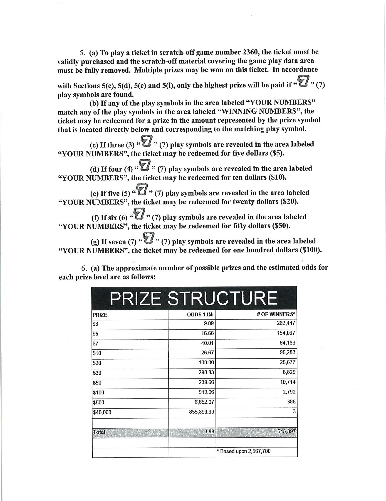

# Table of Contents

This python package contains modules to help with finding and extracting tabular
data from a PDF or image into a CSV format.

Given an image that contains a table&#x2026;

Extract the the text into a CSV format&#x2026;

    PRIZE,ODDS 1 IN:,# OF WINNERS*
    $3,9.09,"282,447"
    $5,16.66,"154,097"
    $7,40.01,"64,169"
    $10,26.67,"96,283"
    $20,100.00,"25,677"
    $30,290.83,"8,829"
    $50,239.66,"10,714"
    $100,919.66,"2,792"
    $500,"6,652.07",386
    "$40,000","855,899.99",3
    1,i223,
    Toa,,
    ,,
    ,,"* Based upon 2,567,700"

The package is split into modules with narrow focuses.

-   `pdf_to_images` uses Poppler and ImageMagick to extract images from a PDF.
-   `extract_tables` finds and extracts table-looking things from an image.
-   `extract_cells` extracts and orders cells from a table.
-   `ocr_image` uses Tesseract to OCR the text from an image of a cell.
-   `ocr_to_csv` converts into a CSV the directory structure that `ocr_image` outputs.

The outputs of a previous module can be used by a subsequent module so that they
can be chained together to create the entire workflow, as demonstrated by the
following shell script.

    #!/bin/sh
    
    PDF=$1
    
    python -m table_ocr.pdf_to_images $PDF | grep .png > /tmp/pdf-images.txt
    cat /tmp/pdf-images.txt | xargs -I{} python -m table_ocr.extract_tables {}  | grep table > /tmp/extracted-tables.txt
    cat /tmp/extracted-tables.txt | xargs -I{} python -m table_ocr.extract_cells {} | grep cells > /tmp/extracted-cells.txt
    cat /tmp/extracted-cells.txt | xargs -I{} python -m table_ocr.ocr_image {}
    
    for image in $(cat /tmp/extracted-tables.txt); do
        dir=$(dirname $image)
        python -m table_ocr.ocr_to_csv $(find $dir/cells -name "*.txt")
    done

The package was written in a [literate programming](https://en.wikipedia.org/wiki/Literate_programming) style. The source code at
<https://eihli.github.io/image-table-ocr/pdf_table_extraction_and_ocr.html> is
meant to act as the documentation and reference material.

